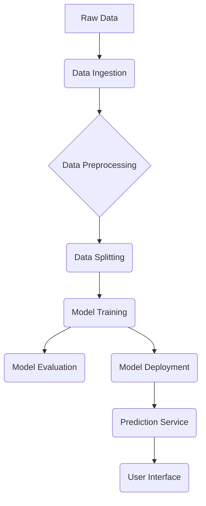

# Architecture Overview Diagram

```mermaid
graph TD
    A[Raw Data] --> B(Data Ingestion)
    B --> C{Data Preprocessing}
    C --> D(Data Splitting)
    D --> E(Model Training)
    E --> F(Model Evaluation)
    E --> G(Model Deployment)
    G --> H(Prediction Service)
    H --> I(User Interface)
```

This diagram illustrates the high-level architecture of the Prices Predictor System.
