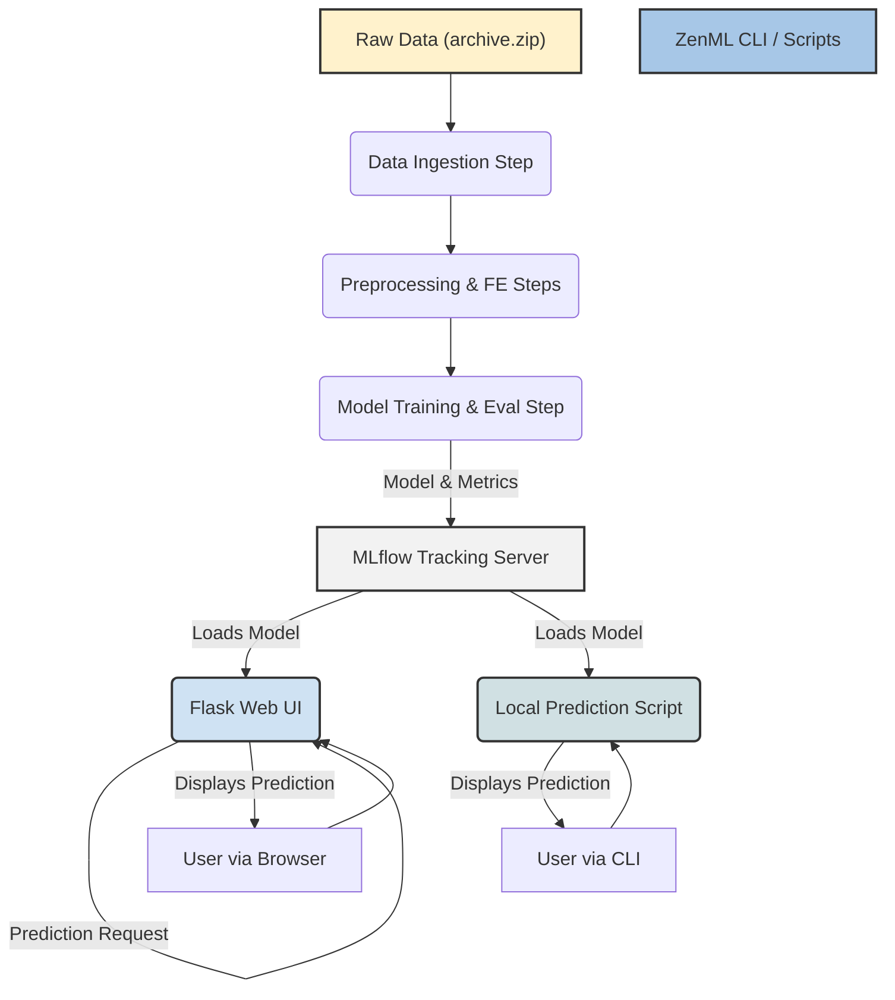

```mermaid
graph TD
    A["Raw Data (archive.zip)"] --> B("Data Ingestion Step");
    B --> C("Preprocessing & FE Steps");
    C --> D("Model Training & Eval Step");
    D -- "Model & Metrics" --> E["MLflow Tracking Server"];
    E -- "Loads Model" --> F("Flask Web UI");
    E -- "Loads Model" --> G("Local Prediction Script");
    
    U["User via Browser"] --> F;
    F -- "Prediction Request" --> F;
    F -- "Displays Prediction" --> U;
    
    H["User via CLI"] --> G;
    G -- "Displays Prediction" --> H;

    I["ZenML CLI / Scripts"];
    %% Defined, but not linked yet to avoid error

    style A fill:#fff2cc,stroke:#333,stroke-width:2px
    style E fill:#f2f2f2,stroke:#333,stroke-width:2px
    style F fill:#cfe2f3,stroke:#333,stroke-width:2px
    style G fill:#d0e0e3,stroke:#333,stroke-width:2px
    style I fill:#a7c7e7,stroke:#333,stroke-width:2px
```
