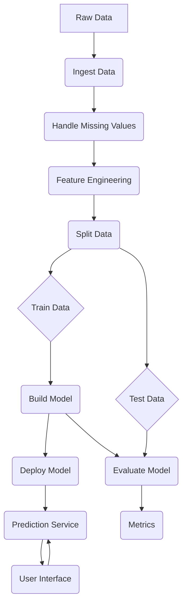

# Data Flow Diagram

```mermaid
graph TD
    A[Raw Data] --> B(Ingest Data)
    B --> C(Handle Missing Values)
    C --> D(Feature Engineering)
    D --> E(Split Data)
    E --> F{Train Data}
    E --> G{Test Data}
    F --> H(Build Model)
    H --> I(Evaluate Model)
    H --> J(Deploy Model)
    J --> K(Prediction Service)
    G --> I
    I --> L(Metrics)
    K --> M(User Interface)
    M --> K
```

This diagram illustrates the flow of data through the ML pipeline and prediction service.
