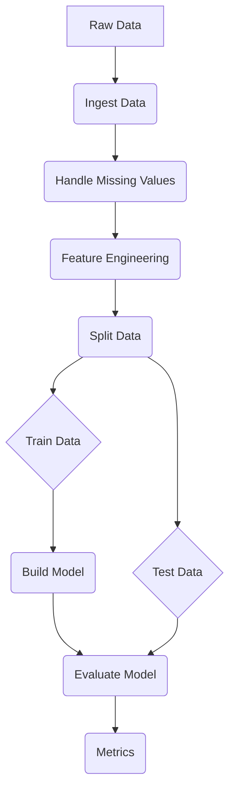

# ML Pipeline Details Diagram

```mermaid
graph TD
    A[Raw Data] --> B(Ingest Data)
    B --> C(Handle Missing Values)
    C --> D(Feature Engineering)
    D --> E(Split Data)
    E --> F{Train Data}
    E --> G{Test Data}
    F --> H(Build Model)
    H --> I(Evaluate Model)
    G --> I
    I --> J(Metrics)
```

This diagram illustrates the detailed steps within the machine learning training pipeline.
