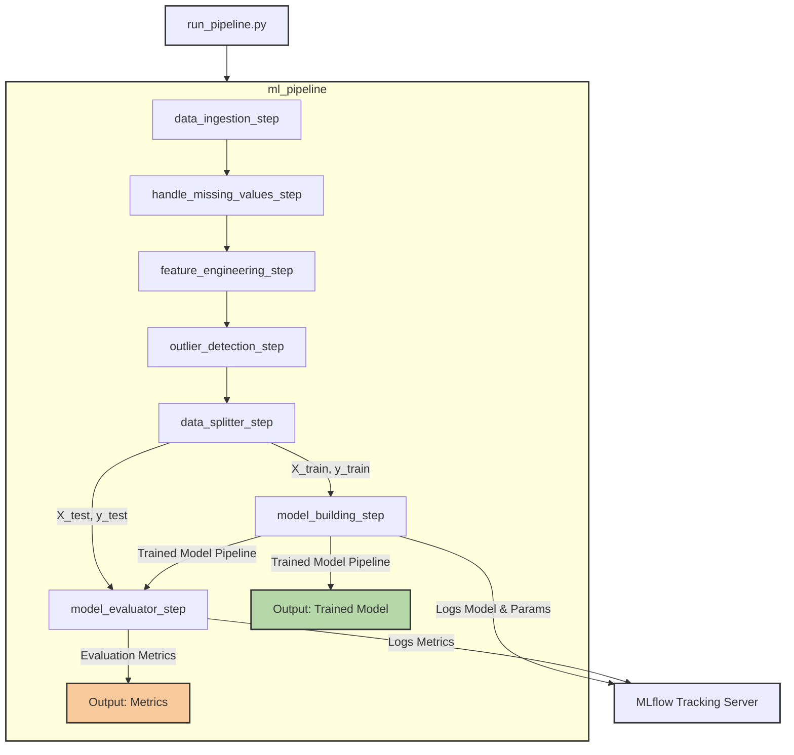

```mermaid
graph TD
    A[run_pipeline.py] --> ZP(ZenML Pipeline: ml_pipeline);

    subgraph ZP [ml_pipeline]
        direction LR
        S1[data_ingestion_step] --> S2[handle_missing_values_step];
        S2 --> S3[feature_engineering_step];
        S3 --> S4[outlier_detection_step];
        S4 --> S5[data_splitter_step];
        S5 -- X_train, y_train --> S6[model_building_step];
        S5 -- X_test, y_test --> S7[model_evaluator_step];
        S6 -- Trained Model Pipeline --> S7;
        S6 -- Trained Model Pipeline --> R1[Output: Trained Model];
        S7 -- Evaluation Metrics --> R2[Output: Metrics];
    end

    S6 -- Logs Model & Params --> MTrack[MLflow Tracking Server];
    S7 -- Logs Metrics --> MTrack;

    style A fill:#orange,stroke:#333,stroke-width:2px
    style ZP fill:#lightgrey,stroke:#333,stroke-width:2px
    style MTrack fill:#lightblue,stroke:#333,stroke-width:2px
    style R1 fill:#b6d7a8,stroke:#333,stroke-width:2px
    style R2 fill:#f9cb9c,stroke:#333,stroke-width:2px
```
