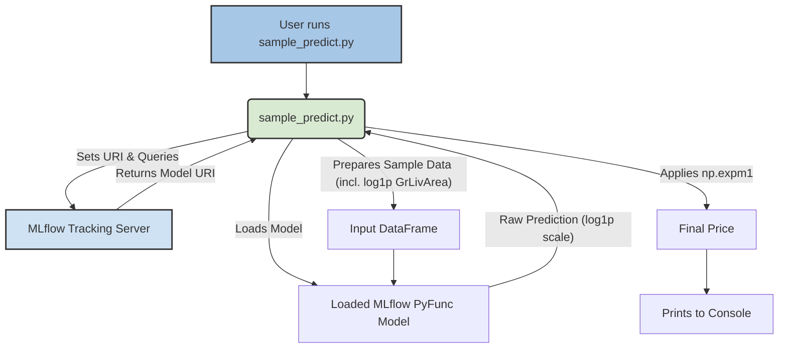

```mermaid
graph TD
    CLI[User runs sample_predict.py] --> SP(sample_predict.py);
    SP -- Sets URI & Queries --> MLflow[MLflow Tracking Server];
    MLflow -- Returns Model URI --> SP;
    SP -- Loads Model --> ModelObj[Loaded MLflow PyFunc Model];
    SP -- Prepares Sample Data (incl. log1p GrLivArea) --> InputDF[Input DataFrame];
    InputDF --> ModelObj;
    ModelObj -- Raw Prediction (log1p scale) --> SP;
    SP -- Applies np.expm1 --> FinalPrediction[Final Price];
    FinalPrediction --> CLIOutput[Prints to Console];

    style CLI fill:#a7c7e7,stroke:#333,stroke-width:2px
    style SP fill:#d9ead3,stroke:#333,stroke:#333,stroke-width:2px
    style MLflow fill:#cfe2f3,stroke:#333,stroke-width:2px
```
