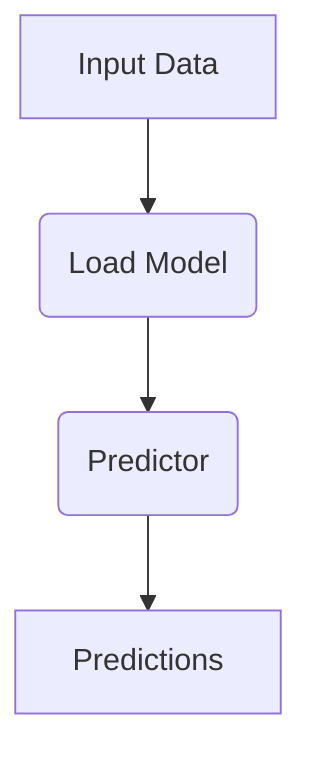

# Local Prediction Script Diagram

```mermaid
graph TD
    A[Input Data] --> B(Load Model)
    B --> C(Predictor)
    C --> D[Predictions]
```

This diagram illustrates the flow for making predictions using a local script.
