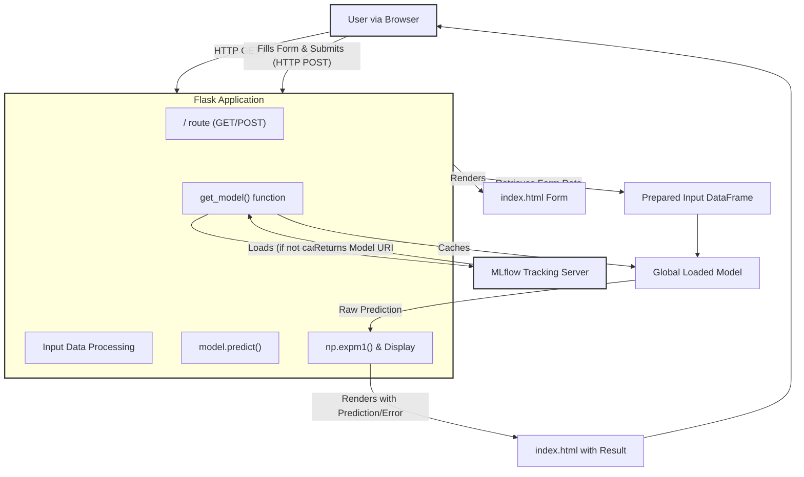

```mermaid
graph TD
    User[User via Browser] -- HTTP GET / --> FlaskUI(Flask App - ui/app.py);
    FlaskUI -- Renders --> FormPage[index.html Form];
    User -- Fills Form & Submits (HTTP POST) --> FlaskUI;
    FlaskUI -- Retrieves Form Data --> ProcessedInput[Prepared Input DataFrame];
    
    subgraph FlaskUI [Flask Application]
        direction LR
        RouteHandler["/ route (GET/POST)"];
        ModelLoader["get_model() function"];
        InputProcessing["Input Data Processing"];
        PredictionLogic["model.predict()"];
        OutputFormatting["np.expm1() & Display"];
    end

    ModelLoader -- Loads (if not cached) --> MLflow[MLflow Tracking Server];
    MLflow -- Returns Model URI --> ModelLoader;
    ModelLoader -- Caches --> CachedModel[Global Loaded Model];
    
    ProcessedInput --> CachedModel;
    CachedModel -- Raw Prediction --> OutputFormatting;
    OutputFormatting -- Renders with Prediction/Error --> ResultPage[index.html with Result];
    ResultPage --> User;

    style User fill:#orange,stroke:#333,stroke-width:2px
    style FlaskUI fill:#lightyellow,stroke:#333,stroke-width:2px
    style MLflow fill:#lightblue,stroke:#333,stroke-width:2px
```
