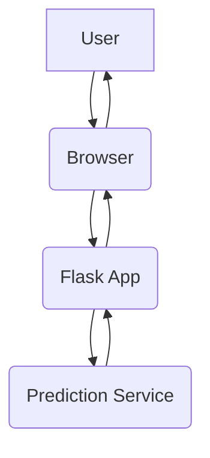

# Flask UI Workflow Diagram

```mermaid
graph TD
    A[User] --> B(Browser)
    B --> C(Flask App)
    C --> D(Prediction Service)
    D --> C
    C --> B
    B --> A
```

This diagram illustrates the workflow of the Flask-based user interface interacting with the prediction service.
